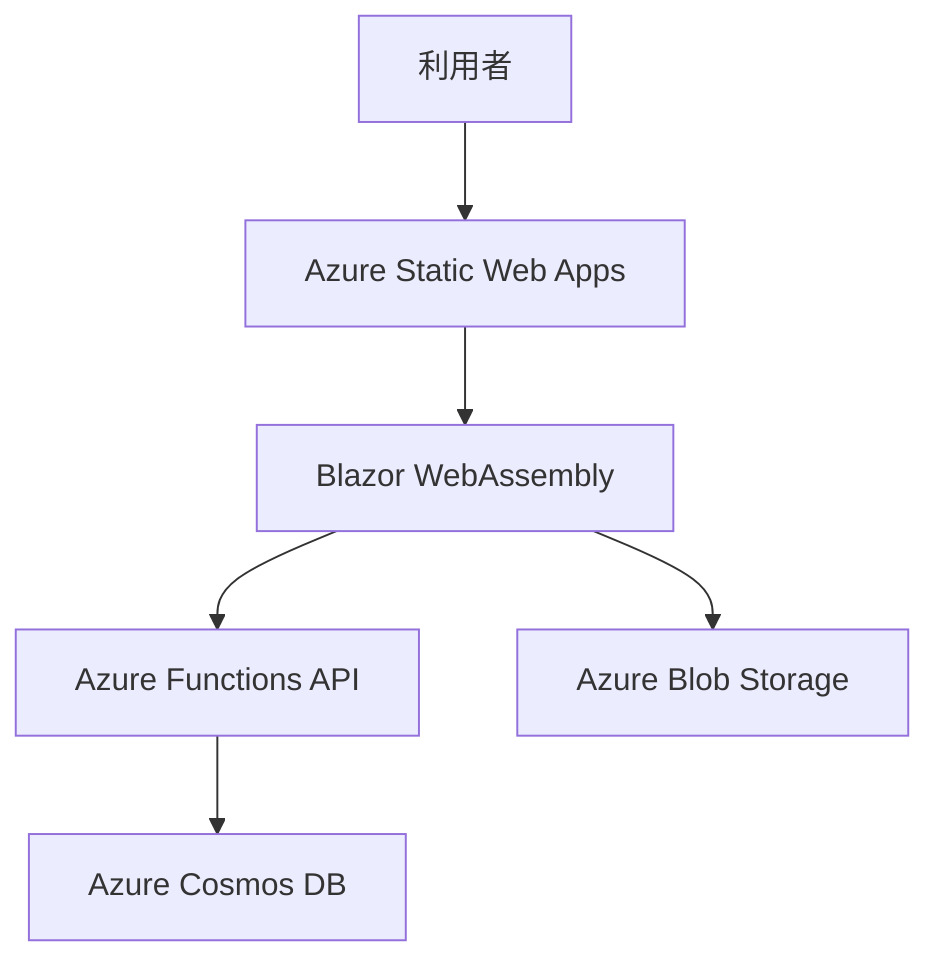
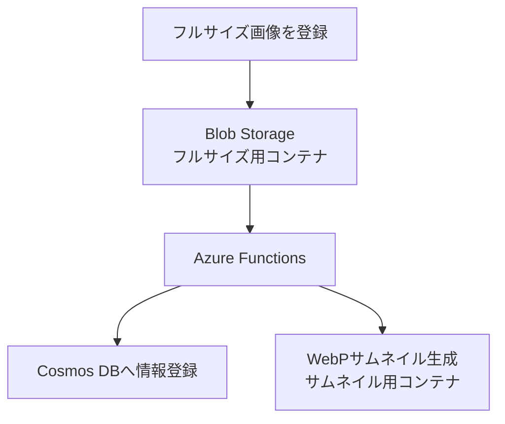

# Portfolio

C#／Blazorを中心とした開発経験と、Webデザインの制作実績を紹介するポートフォリオサイトです。

Figmaによる画面設計から、Blazor WebAssemblyでのフロントエンド実装、Azure FunctionsとAzure Cosmos DBを利用したデータ取得、Azure Static Web Appsへのデプロイまで一貫して制作しました。

## 制作目的

ソフトウェア開発とWebデザインの双方について、これまでの経験、保有スキル、制作物を一つのサイトで伝えることを目的としています。

単に情報を掲載するだけでなく、デザインと実装を一貫して担当できること、要件整理から設計・開発・運用までを見通して構成できることが伝わるサイトを目指しました。

## 主な機能

- プロフィールと保有スキルの表示
- 職歴と担当プロジェクトの表示
- バナー、フライヤーなどの制作物一覧
- モーダルによる職歴・制作物の詳細表示
- 制作目的、ターゲット、デザイン上の工夫などを含むケーススタディ表示
- ポートフォリオサイトの技術構成紹介
- 問い合わせ受付状態に応じた案内表示
- PC・タブレットを中心としたレスポンシブ対応

## 技術構成

| 分類 | 技術 | 用途 |
| --- | --- | --- |
| フロントエンド | C# / .NET 10 / Blazor WebAssembly | UIと画面ロジックの実装 |
| UI | Razor Components / MudBlazor | 再利用可能なコンポーネントと一部UI部品の実装 |
| スタイル | CSS Grid / Flexbox / Media Queries | レイアウトとレスポンシブ対応 |
| API | Azure Functions Isolated | ポートフォリオデータを提供するAPI |
| データベース | Azure Cosmos DB | プロフィール、スキル、職歴、制作物などの管理 |
| 画像ストレージ | Azure Blob Storage | 制作物画像とWebPサムネイルの保存 |
| ホスティング | Azure Static Web Apps | Blazor WebAssemblyアプリの公開 |
| CI/CD | GitHub Actions | GitHubへのPushを契機とした自動デプロイ |
| デザイン | Figma | ワイヤーフレームと画面デザインの作成 |

## システム構成

画面に表示するプロフィール、スキル、職歴、制作物などのデータは、Blazorへ直接記述せずAzure Cosmos DBで管理しています。Blazor WebAssemblyからAzure FunctionsのAPIを呼び出し、取得したデータを各コンポーネントへ表示します。



フロントエンドとAPIは別々にデプロイできるよう分離しています。このリポジトリではBlazorフロントエンドを管理し、Azure Functionsは別リポジトリで管理しています。両者で使用するデータ構造はSharedプロジェクトで共有しています。

## 画像登録・サムネイル生成

制作物のフルサイズ画像をAzure Blob Storageへ登録すると、そのイベントを受け取ったAzure Functionsが次の処理を行います。

1. 画像情報をAzure Cosmos DBへ登録する
2. 一覧表示用のWebPサムネイルを生成する
3. サムネイル専用のBlobコンテナへ保存する



フルサイズ画像とサムネイルの保存先を別コンテナにすることで、生成したサムネイルを起点として同じ処理が再実行されることを防いでいます。一覧では軽量なWebPサムネイルを使用し、詳細表示時のみフルサイズ画像を参照します。

## 設計・実装上の工夫

### デザインから実装まで一貫して制作

FigmaでPC版とタブレット版の画面を設計し、その意図を保ちながらRazor ComponentsとCSSで実装しました。既製のUIライブラリに全面的に依存せず、サイト固有の表示は自作コンポーネントを中心に構成し、入力欄など一部のUI部品にMudBlazorを使用しています。

### コンテンツと画面実装の分離

プロフィール、スキル、職歴、制作物、お問い合わせ設定をAzure Cosmos DBで管理しています。掲載内容を画面へ直接記述しないことで、コンテンツの追加・変更がUI実装へ及ぼす影響を抑えています。

### 再利用可能なコンポーネント設計

ヘッダー、フッター、各セクション、カード、詳細モーダルなどをRazor Componentsとして分割し、責務と再利用範囲が分かる構成にしています。

### 制作意図まで伝える作品データ

制作物は画像とタイトルだけでなく、制作目的、想定ターゲット、制作条件、コンセプト、デザイン上の工夫、担当範囲、振り返りなどをデータとして保持しています。見た目だけでなく、課題をどのように捉えて設計したかを説明できる構成にしました。

### レスポンシブ対応

CSS Grid、Flexbox、Media Queriesを使用し、PC版とタブレット版を中心にレイアウトを調整しています。各セクションへのアンカー移動では固定ヘッダーとの重なりを避けるため、スクロール位置も補正しています。

### CI/CD

GitHubへのPushを契機にGitHub Actionsを実行し、Azure Static Web Appsへ自動的にデプロイします。ソースコードの更新から公開までを継続的に行える構成です。

## 制作範囲

本サイトは個人制作であり、次の工程を担当しました。

- 要件と掲載内容の整理
- Figmaによる画面設計
- データ構造とコンポーネント構成の設計
- Blazor WebAssemblyによるフロントエンド実装
- Azure FunctionsによるAPI・画像処理の実装
- Azure Cosmos DB、Azure Blob Storageとの連携
- レスポンシブ調整と動作確認
- GitHub ActionsとAzure Static Web Appsによる公開環境の構築

## ローカルでの実行

### 必要環境

- .NET 10 SDK
- Visual Studio 2026、Visual Studio Code、または.NET CLIを利用できる環境

### 起動方法

リポジトリをクローンし、Blazorプロジェクトのディレクトリで次のコマンドを実行します。

```bash
dotnet restore
dotnet run
```

実行後、コンソールに表示されたローカルURLへアクセスしてください。

### API接続設定

ローカル環境では、Gitの管理対象外となるローカル設定ファイルにAzure FunctionsのAPI URLを設定します。公開環境の設定値はAzure側で管理します。

接続文字列、APIキーなどの秘密情報はリポジトリへ含めていません。そのため、データ取得を含むすべての機能をローカルで動作させるには、別途Azure FunctionsとAzure Cosmos DBの開発環境が必要です。


## 利用上の注意

本リポジトリに掲載しているプロフィール情報、文章、画像、デザイン制作物について、許可のない転載・再利用を禁止します。

ソースコードの利用条件については、リポジトリに設定されたライセンスを参照してください。ライセンスが明示されていない場合、ソースコードの複製・再配布・改変を許諾するものではありません。
